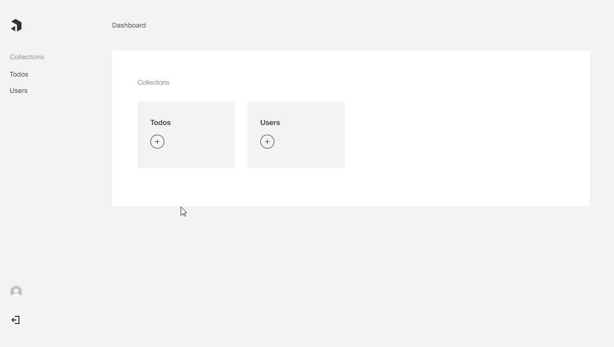

# Custom Field Sample Project - Color Picker

This is an example Payload CMS project that has a custom color picker field and was created for the blog post [Building a Custom Field for Payload](https://payloadcms.com/blog/building-a-custom-field)

### Color Picker Field Features
- Payload compatible field configuration
- Custom input for admin panel
- Custom Cell component
- Input validation for frontend and backend
- User preferences that remember individual user's color choices

## Prerequisites: 
- MongoDB
- Node

## Steps to run this project: 
- git clone git@github.com:payloadcms/custom-field-guide.git
- `cp .env.example .env`
- edit `.env` file to have valid MongoDB connection
- `yarn` or `npm install`
- `yarn dev` or `npm run dev`
- after startup open web browser to <a href="http://localhost:3000/admin">localhost:3000/admin</a>
